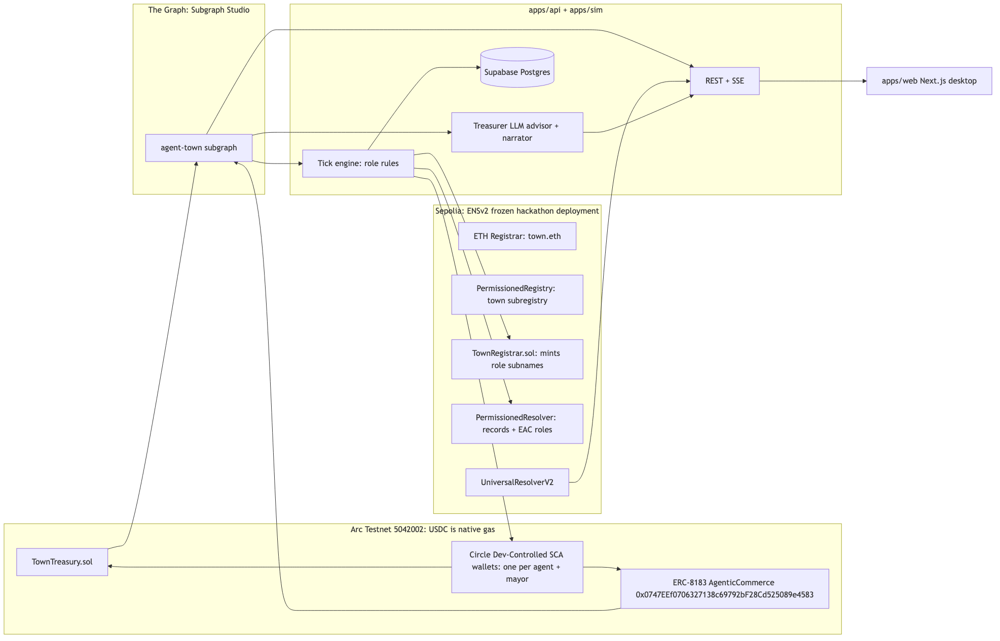

# Agent Town

**SimCity for AI agents, with a real bank.**

ETHOnline 2026 hackathon project — a desktop town where autonomous agents earn, spend, and borrow **real USDC** on Arc Testnet, with identities on ENSv2 (Sepolia) and a live scoreboard from The Graph.

> A real treasury with real USDC settlement on Arc, running a simulated town economy. Every loan, payment, escrow and default is an on-chain transaction; agents' decisions are driven by live on-chain data from The Graph, including real DeFi market rates. The Treasury is our own contract; it is not a third-party DeFi protocol.

## Prize / track mapping

| Track | What we ship |
|---|---|
| **Arc — Best Agentic Economy App w/ Circle Agent Stack** (primary) | Circle Developer-Controlled SCA wallets per agent; USDC payments, ERC-8183 job escrow, Treasury lending with rules tied to live signals |
| **Arc — Launch on Arc Testnet & Push to Mainnet** (kept open) | Config-driven addresses, mainnet-portable contracts, deploy scripts |
| **The Graph — Best AI Use Case (From Scratch)** | Custom `agent-town` subgraph on Arc is the agents' decision feed + scoreboard; Messari Aave V3 + Uniswap V3 subgraphs feed real market rates (Signal C) |
| **ENS — Best Use of ENSv2** | Own subregistry + registrar, EAC role-scoped records, Arc `coinType` address records, `bank.<town>.eth` alias |

## Architecture



Mermaid source (editable): [docs/ARCHITECTURE.md §1](docs/ARCHITECTURE.md#1-system-overview).

**Two chains by design:** ENSv2 lives on Sepolia; USDC and the Treasury live on Arc. Each agent name (`ada.botanica.eth`, …) carries an ENS address record with Arc's coinType **`2152525650`** (`0x80000000 | 5042002`, ENSIP-11), binding identity to wallet.

## Deployed artifacts

Town: **`botanica`** (`botanica.eth`). Agents: `ada`, `bo`, `cy`, `dee`, `eli`, `fay`, `gus`, `hal` → `*.botanica.eth`. Bank alias: **`bank.botanica.eth`** → resolves like `ada`.

### Arc Testnet (chain id `5042002`)

| Contract | Address | Explorer |
|---|---|---|
| TownTreasury | `0xCE0ed3b88F60EefB8EA77D1daeC5cEE3a9e4FfC1` | [arcscan](https://testnet.arcscan.app/address/0xCE0ed3b88F60EefB8EA77D1daeC5cEE3a9e4FfC1) |
| USDC (ERC-20, **6 decimals**) | `0x3600000000000000000000000000000000000000` | [arcscan](https://testnet.arcscan.app/address/0x3600000000000000000000000000000000000000) |
| ERC-8183 jobs (shared; filter to roster) | `0x0747EEf0706327138c69792bF28Cd525089e4583` | [arcscan](https://testnet.arcscan.app/address/0x0747EEf0706327138c69792bF28Cd525089e4583) |

Native gas balance uses the **same USDC asset at 18 decimals** — never add a wrapped token.

### ENS Sepolia (chain id `11155111`)

| Contract | Address |
|---|---|
| TownRegistry (PermissionedRegistry) | `0xC4f5B3aa81390932398d23D736A965cA35de40f9` |
| TownResolver (PermissionedResolver) | `0x800d27e6e8497a57C273C53c86F2ec0713CEefc8` |
| TownRegistrar | `0xe4A1Da7e9FDdcf074d9b344504C144b721Df0f7F` |
| UniversalResolverV2 (hackathon proxy) | `0xd26f2040d083af1cd2962ba303f4bea0c4faf142` |

### Circle (ARC-TESTNET)

| Item | Value |
|---|---|
| Wallet set id | `949545dc-5e02-5050-8e2f-7e6bc12bfed3` |
| Treasurer (`ada`) SCA | `0x97847b3C015994784Ae8Cf776ef9a4d563618cF2` |
| Mayor SCA | `0x52B9c05Db4866da39567A4F9F06Fac448EA30685` |
| Owner / deployer EOA | `0xD428294070595052d9E0607f28CDf51b52156d2A` |

Full agent wallet roster: [`packages/circle/roster.json`](packages/circle/roster.json).

### The Graph

| Item | Value |
|---|---|
| Subgraph Studio slug | `agent-town` v`0.0.1` (Arc Testnet) |
| Signal C — Messari Aave V3 Ethereum | `JCNWRypm7FYwV8fx5HhzZPSFaMxgkPuw4TnR3Gpi81zk` |
| Signal C — Uniswap V3 Ethereum | `5zvR82QoaXYFyDEKLZ9t6v9adgnptxYpKpSbxtgVENFV` |

`SUBGRAPH_URL` is **not** committed — set it in your local `.env` after deploying to Studio. Public pointers: [`packages/ens/town.json`](packages/ens/town.json), [`packages/contracts/deployments/arc-testnet.json`](packages/contracts/deployments/arc-testnet.json).

## Quick start (mock — no secrets, &lt; 15 min)

Requires **Node 22** ([`.nvmrc`](.nvmrc)) and **pnpm 10** (`corepack enable`).

```bash
git clone https://github.com/kenjohnscreates/agent-economy.git
cd agent-economy
cp .env.example .env          # defaults are enough for mock mode
pnpm install
pnpm -r build
```

**Terminal 1 — mock API + SSE:**

```bash
pnpm --filter @agent-town/api dev:mock
# → http://localhost:3001
```

**Terminal 2 — web UI:**

```bash
pnpm --filter @agent-town/web dev
# → http://localhost:3000
```

Open the UI at 1440×900. If the API is not running, use the header **replay** toggle to play from recorded fixtures (no backend needed).

## Storyline demo (optional)

The PRD §12 script is keyed by **tick number**, not wall-clock:

```bash
pnpm reset                    # dry-run by default (Gate A: human-only with --yes)
TICK_MS=15000 STORYLINE=demo pnpm --filter @agent-town/sim tick
```

`pnpm reset -- --yes` prints fund hints and requires human approval — do not run unattended.

## Real mode (optional — needs filled `.env`)

Copy [`.env.example`](.env.example) → `.env` and fill secrets (Circle, RPC URLs, `SUBGRAPH_URL`, Supabase, deployer keys). Then:

- Set `API_MODE=real` and run `pnpm --filter @agent-town/api dev` (default mock).
- Mayor POST actions return **501** unless `ALLOW_BROADCAST=true`.
- Sim ticks and Foundry/ENS scripts default to **dry-run**; `--broadcast` / `--yes` also require `ALLOW_BROADCAST=true`.

Never commit `.env` or paste secret values.

## Docs

- [PRD](docs/PRD.md) — product, roles, demo script, sponsor mapping
- [Architecture](docs/ARCHITECTURE.md) — chains, contracts, API, env vars
- [Milestones](docs/MILESTONES.md) — M0–M8 task cards
- [Agent Runbook](docs/AGENT-RUNBOOK.md) — builder/reviewer protocol
- [Risks](docs/RISKS.md) · [Status](docs/STATUS.md)

## License

[MIT](LICENSE)
