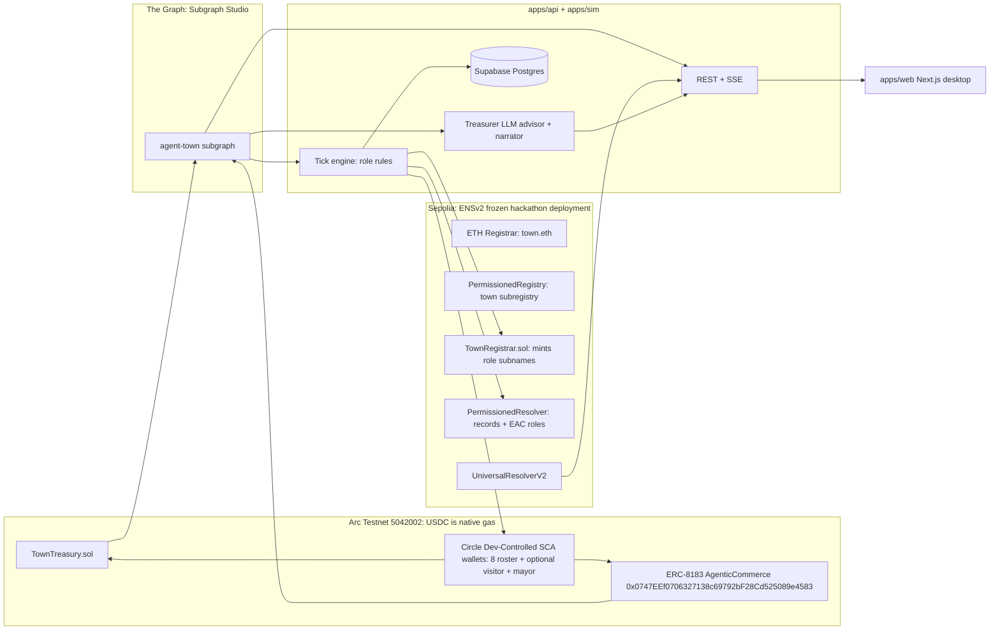
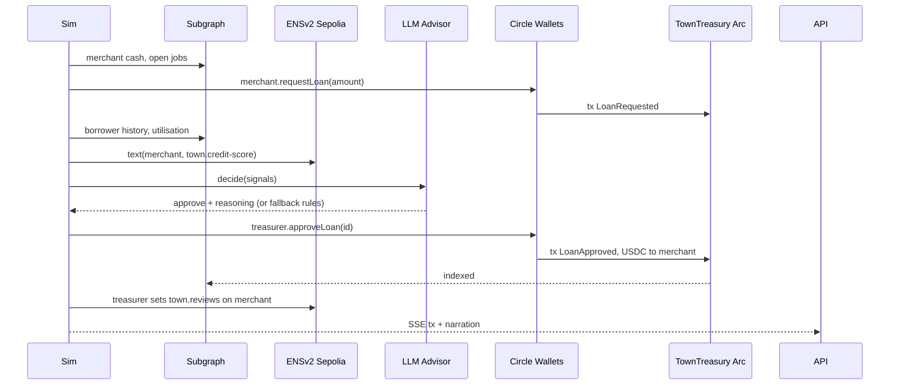

# Agent Town — Architecture (v0.1)

## 1. System overview



Two chains are forced: ENSv2 exists only on Sepolia; USDC/Arc products exist only on Arc. The binding is an ENS address record with Arc's coinType on each agent name.

## 2. Chains & constants

| Item | Value |
|---|---|
| Arc Testnet chain id | `5042002` |
| Arc RPC | `https://rpc.testnet.arc.io` (alts: blockdaemon, drpc, quicknode subdomains) |
| Arc explorer | `https://testnet.arcscan.app` |
| Arc faucet | `https://faucet.circle.com` (rate‑limited: fund one wallet, fan out) |
| Arc gas token | Native USDC (**18 decimals** for gas/`eth_getBalance` only); 20 gwei `maxFeePerGas` floor; `address(0)` sends revert |
| **USDC ERC‑20 interface** | `0x3600000000000000000000000000000000000000`, **6 decimals**. Contracts and all app math use this interface only; never mix with native 18‑dec balance. No wrapped USDC exists. |
| Solidity target | `evm_version = "paris"` in `foundry.toml` (Arc lacks PUSH0); verify with `--evm-version paris` |
| ERC‑8183 reference | `0x0747EEf0706327138c69792bF28Cd525089e4583` |
| Other Arc predeploys | Multicall3 `0xcA11…CA11`, Permit2 `0x0000…8BA3`, CREATE2 factory `0x4e59…956C`, EURC `0x89B5…D72a` |
| ENS coinType for Arc (ENSIP‑11) | `0x80000000 | 5042002` = `2147483648 + 5042002` = **2152525650** |
| Sepolia chain id | `11155111` |
| ENSv2 hackathon deployment | addresses from docs.ens.domains banner → hackathon feature branch (**not** the main Sepolia beta). Record in `packages/ens/deployments.json` in M0 |
| viem | `import { arcTestnet, sepolia } from "viem/chains"` |

## 3. Repository layout (pnpm monorepo)

```
apps/
  web/            Next.js (FE owner). Desktop only.
  api/            Hono/Fastify REST + SSE. Reads subgraph, ENS, Supabase; exposes mayor actions.
  sim/            Tick engine. Runs role rules, advisor, narrator; writes txs via Circle wallets.
packages/
  contracts/      Foundry: TownTreasury.sol, TownRegistrar.sol (+ tests, deploy scripts)
  subgraph/       schema.graphql, subgraph.yaml, mappings (AssemblyScript)
  ens/            ENSv2 client: resolve, setRecords, role checks (viem + UniversalResolverV2)
  circle/         Circle Developer‑Controlled Wallets wrapper (create, fund, execute, poll)
  graphclient/    Typed subgraph queries (graphql-request + codegen)
  shared/         zod schemas for API + events; role/rule constants; agent roster
docs/
```

## 4. Contracts

### 4.1 `TownTreasury.sol` (Arc)

Mainnet‑portable; all addresses via constructor/config. USDC handled via the ERC‑20 interface at the configured address (`0x3600…0000`, **6 decimals**); use `SafeERC20` and read `decimals()` rather than hardcoding.

```solidity
// roles: OWNER (deployer/mayor), TREASURER (agent wallet)
function deposit(uint256 amount)                              // any agent; savings
function withdraw(uint256 amount)
function requestLoan(uint256 amount, uint32 termTicks) returns (uint256 loanId) // borrower → Pending
function approveLoan(uint256 loanId)                          // TREASURER or OWNER; transfers USDC
function denyLoan(uint256 loanId)
function repay(uint256 loanId, uint256 amount)                // borrower; interest = principal*rate*elapsed
function markDefault(uint256 loanId)                          // TREASURER; after dueBlock + grace
function setBaseRateBps(uint16 bps)                           // TREASURER or OWNER
function fund(uint256 amount)                                 // mayor top‑up
function payStipend(address to, uint256 amount)               // TREASURER; consumer UBI
// views: balance(), utilisationBps(), loan(id), stats()
```

Events (indexed by subgraph): `Deposited`, `Withdrawn`, `LoanRequested`, `LoanApproved`, `LoanDenied`, `Repaid`, `Defaulted`, `BaseRateSet`, `Funded`, `StipendPaid`.

### 4.2 Jobs: ERC‑8183 reference contract (Arc)

Use as‑is: `createJob(provider, evaluator, expiredAt, description, hook)` → fund escrow (USDC) → provider `submit(deliverableHash)` → evaluator `complete` → settlement. Merchant = client + evaluator, worker = provider. Events consumed by subgraph.

### 4.3 `TownRegistrar.sol` (Sepolia, ENSv2)

Built on the "For Contract Developers" pattern. Owns the town subregistry via EAC roles.

```solidity
enum Role { Treasurer, Merchant, Worker, Consumer }
function register(string label, address owner, Role role) returns (uint256 tokenId)
```
Per role, on mint:
- `treasurer`: full admin on own name; granted `ROLE_SET_TEXT` on **every** agent name for keys `town.credit-score`, `town.reviews` (accountability).
- `merchant`: transferable; can set `agent-context`, `description`, `town.price`.
- `worker`: **non‑transferable**; can set `agent-context`, `description` only.
- `consumer`: **expiring** (short expiry, renewable by registrar).
- `bank.<town>.eth`: **record alias** → treasurer's records.

Do not cache `tokenId`s: they change after any role grant/revoke (mutable token IDs). Re-read via registry.

### 4.4 ENS records per agent name

| Key | Value |
|---|---|
| `addr(coinType 2152525650)` | agent's Arc Circle wallet address |
| `addr(60)` | same address (EVM) for wallets that ignore coinType |
| `agent-context` (ENSIP‑26) | markdown: role, town, endpoints, registry pointers |
| `agent-endpoint[web]` | `https://<app>/agents/<name>` |
| `town.role` | `treasurer|merchant|worker|consumer` |
| `town.credit-score` | `0–100` (treasurer‑only writer) |
| `town.reviews` | JSON array of `{by, tick, score, note}` (treasurer‑only writer) |
| `town.price` | merchant's current good price, 6‑dec USDC string (merchant‑only writer) |
| `avatar` | sprite URL |

Resolution in app: `UniversalResolverV2.resolve(dnsEncode(name), calls[])`. Reverse (primary name) for Arc addresses is optional stretch.

## 5. Subgraph (`agent-town`, network: Arc Testnet)

```graphql
type Agent @entity { id: Bytes! ensName: String role: String balanceDeposited: BigInt! loansTaken: Int! defaults: Int! jobsCompleted: Int! earned: BigInt! spent: BigInt! }
type Loan @entity { id: ID! borrower: Agent! principal: BigInt! rateBps: Int! status: String! requestedAt: BigInt! approvedAt: BigInt repaid: BigInt! defaultedAt: BigInt }
type Job @entity { id: ID! client: Agent! provider: Agent! amount: BigInt! status: String! createdAt: BigInt! settledAt: BigInt }
type Payment @entity(immutable: true) { id: Bytes! from: Agent! to: Agent! amount: BigInt! kind: String! tx: Bytes! timestamp: BigInt! }
type TreasurySnapshot @entity(immutable: true) { id: Bytes! balance: BigInt! outstanding: BigInt! baseRateBps: Int! timestamp: BigInt! }
type TownStat @entity(timeseries: true) { id: Int8! timestamp: Timestamp! volume: BigInt! }
type TownDaily @aggregation(intervals: ["hour","day"], source: "TownStat") { id: Int8! timestamp: Timestamp! gdp: BigInt! @aggregate(fn: "sum", arg: "volume") }
```

Data sources: `TownTreasury` (all events), `AgenticCommerce` ERC‑8183 (job lifecycle events). `ensName` is written by the sim into an on‑chain `AgentRegistered(address, string ensName)` event emitted by `TownTreasury.registerAgent` so the subgraph can join names without off‑chain input.

Consumers: `apps/sim` (rules), advisor tool `querySubgraph(gql)`, `apps/api` scoreboard. Query via Studio endpoint with `GRAPH_API_KEY`.

### 5.1 External signals (Signal C) — `packages/graphclient/external.ts`

Existing public subgraphs on The Graph Network, queried through the same gateway key. Exact subgraph IDs chosen in M0 via the Subgraph MCP (must show live 30‑day query volume).

| Signal | Source (candidate) | Query | Used by |
|---|---|---|---|
| `usdcBorrowApyBps` | Messari standardized **lending** subgraph (Aave V3 Ethereum) | `market(id: USDC).rates(side: BORROWER, type: VARIABLE).rate` | treasurer base rate |
| `dexVolume24hUsd` | Uniswap V3 Ethereum (Messari standardized **DEX** schema) | `liquidityPool(USDC/WETH).cumulativeVolumeUSD` delta / daily snapshot | merchant price & consumer demand multiplier |

Rules: fetched once per tick, cached in `signals` table with timestamp; on error or > 5 s, use last known value and mark `stale=true` (shown in UI). Never blocks a tick. Exposed on `GET /scoreboard` as `signals` so the UI can show "market rate 4.1% → town rate 6.1%".

## 6. Backend

### 6.1 Tick engine (`apps/sim`)
- `TICK_MS` (default 15 000). Per tick: pull subgraph state + external signals → for each agent run `decide(state) → Action[]` → execute via `packages/circle` → persist tick log + narration.
- Idempotency: each action keyed by `(tick, agent, kind)`; skip if already has tx.
- Circle execution: `createContractExecutionTransaction` / `createTransferTransaction`, submitted in parallel, then polled until `COMPLETE`. Next tick starts on schedule even if a prior tx is still pending; the ledger records it when it lands.
- Feature flags: `LLM_ADVISOR=on|off`, `LLM_NARRATOR=on|off`, `STORYLINE=demo|free`, `EXTERNAL_SIGNALS=on|off`.
- Dev controls: `pnpm tick --once` / `--ticks N` advance manually; `MAX_TICKS` (default 50) stops a forgotten loop; storyline events are keyed by **tick number**, never wall‑clock, so the same script plays at any `TICK_MS`.
- Cadence profile: dev 60 000 or manual; integration 20–30 000; demo 15 000.

### 6.2 Treasurer advisor
Input JSON: borrower name, credit score (ENS), balance history + defaults (subgraph), treasury utilisation, base rate. Output: `{decision: approve|deny|flag, maxAmount, reasoning, confidence}`. Guard: `maxAmount ≤ rulesMax`; on error/timeout ≥ 8 s → rules decision. Provider abstraction: Anthropic or OpenAI via Vercel AI SDK.

### 6.3 API (`apps/api`) — contract frozen in M0
| Method | Path | Returns |
|---|---|---|
| GET | `/state` | `tick, phase, flags{llmAdvisor,llmNarrator,externalSignals,storyline}, tickMs, maxTicks, startedAt` |
| GET | `/agents` | `AgentSummary[]`: `name, ensName, role, arcAddress, balanceUsdc, creditScore, position{building,x,y}, lastDecision, narration, avatar` |
| GET | `/agents/:name` | `AgentSummary` + `loans[], jobs[], reviews[], links{arcscan,ens}` (subgraph + ENS) |
| GET | `/scoreboard` | `gdpUsdc, treasuryBalanceUsdc, outstandingUsdc, defaults, defaultRateBps, baseRateBps, ticks, jobsCompleted, loansOutstanding, gdpSeries[], signals{…,stale}, rate{market/spread/premium/town}` |
| GET | `/events` | SSE: `tick`, `tx`, `narration`, `loan_flagged`, `scoreboard` (envelope `{event, data}`) |
| GET | `/loans?status=pending` | `Loan[]` — flagged loans for mayor |
| POST | `/mayor/fund` | `{amountUsdc}` → `{txHash, explorerUrl}` |
| POST | `/mayor/loan-decision` | `{loanId, approve}` → `{txHash, explorerUrl}` |
| POST | `/mayor/rate` | `{bps 100–2000}` → `{txHash, explorerUrl}` |
| GET | `/visitor` | `VisitorResponse` or 404 — off-roster admit (M9.6) |
| POST | `/visitor` | `{label}` → `name, ensName, role, arcAddress, balanceUsdc, explorerUrl, ensUrl` |
| POST | `/visitor/chat` | `{text}` → `{reply, txHash, explorerUrl}` — balance / deposit only |

**Frozen in M0.6 (PR #5, `902dd74`).** All shapes in `packages/shared/src/api.ts` (zod 4); SSE payloads in `events.ts`; fixtures in `fixtures.ts`. USDC amounts are 6‑decimal integer **strings** (`"3000000"` = 3 USDC), never JS numbers; rates in bps. Default API port `3001`. A mock server (`apps/api --mock`) serves the fixtures so FE work never blocks on chain readiness. Changes after freeze need both humans' ack + mock update in the same PR (RUNBOOK §6). **M9.6 (#61) adds visitor routes + mock + UI in one PR** — visitor is **not** in `AGENT_NAMES` / sim `decide()`.

### 6.4 Supabase tables
`ticks(id, ts, phase)`, `actions(tick, agent, kind, tx, status)`, `narration(tick, agent, text)`, `cache_agents(name, json, ts)`.

SQL: `apps/sim/supabase/migrations/001_ledger.sql`. MCP `apply_migration` does **not** GRANT DML — PostgREST `service_role` needs `SELECT, INSERT, UPDATE, DELETE`. Anon has no SELECT (server-only). **Do not enable RLS** without policies (blocks sim). Service key = JWT `service_role` or `sb_secret_…`, never `sb_publishable_…`.

## 7. Sequence: merchant loan



## 8. Environment variables (`.env.example`)

```
# Arc / chain
ARC_RPC_URL=https://rpc.testnet.arc.io
ARC_USDC_ADDRESS=0x3600000000000000000000000000000000000000   # ERC-20 interface, 6 decimals
TOWN_TREASURY_ADDRESS=
ERC8183_ADDRESS=0x0747EEf0706327138c69792bF28Cd525089e4583
SEPOLIA_RPC_URL=
DEPLOYER_PRIVATE_KEY=            # Foundry deploys only
# Circle
CIRCLE_API_KEY=
CIRCLE_ENTITY_SECRET=
CIRCLE_WALLET_SET_ID=
# ENS
ENS_TOWN_NAME=
ENS_UNIVERSAL_RESOLVER_V2=
ENS_TOWN_REGISTRY=
ENS_TOWN_RESOLVER=
ENS_TOWN_REGISTRAR=
ENS_TREASURER_PRIVATE_KEY=       # Sepolia signer for record writes
# Graph
GRAPH_API_KEY=
SUBGRAPH_URL=
EXT_LENDING_SUBGRAPH_ID=         # Signal C: Messari standardized lending (Aave V3 Ethereum)
EXT_DEX_SUBGRAPH_ID=             # Signal C: Uniswap V3 Ethereum
EXTERNAL_SIGNALS=on
MAX_TICKS=50
# LLM
LLM_PROVIDER=anthropic|openai|off
ANTHROPIC_API_KEY=
OPENAI_API_KEY=
# App
SUPABASE_URL=
SUPABASE_SERVICE_KEY=            # service_role / sb_secret_ only; never publishable
TICK_MS=15000
NEXT_PUBLIC_API_URL=
API_MODE=mock                    # real for live demo
ALLOW_BROADCAST=                 # string `true` for mayor POSTs / sim --yes
ALLOW_VISITOR=                   # string `true` for public visitor mint+chat (or inherit ALLOW_BROADCAST)
```

## 9. Frontend (owner: FE dev) — inputs it needs
- `packages/shared` types, mock server, sprite/role list, SSE event names. **M9.6:** `API_ROUTES.visitor` / `visitorChat`, `VisitorPanel`, 9th `AgentCard`.
- Desktop **1440×900** layout (PRD §6.1):
  - **Left:** Pixi map (roster-only; frozen `MapSlotProps` / `ZONES` / `zonePoint`) → **Your agent** panel → agent grid 4×2 or **3×3 when 9**.
  - **Right:** Scoreboard, Bank (rate tooltip from `scoreboard.signals`), Mayor (**#11**), Feed.
- Visitor: not a map sprite. Card `data-you`, `/sprites/visitor.png`. Chat only when `health.mode === "real"`. Replay = panel disabled.
- Link‑outs: arcscan tx/address, ENS name (app‑side resolution display).
