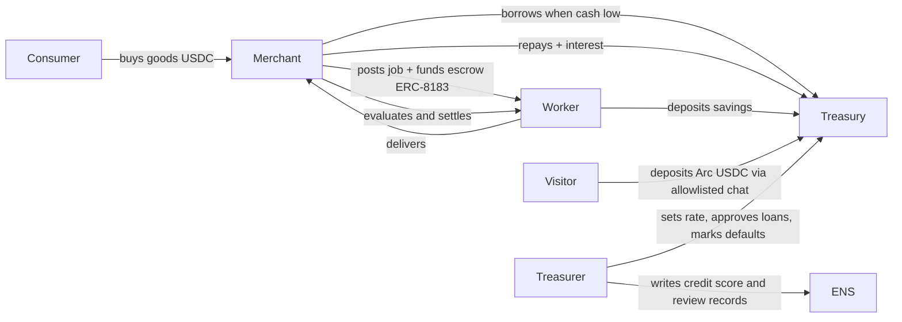

# Agent Town — Product Requirements (v0.3)

> ETHOnline 2026 · Deadline **Sun 13 Sep 12:00 EDT** (no late entries) · Code freeze **Sun 08:00 EDT**
> **Video: record Sat 12 Sep against live testnet** (mock / `/map-demo` = rehearsal only)
> Sponsors: **ENSv2** (Sepolia) · **Arc** (Circle L1, testnet) · **The Graph** (Subgraph Studio)
> Companion docs: [ARCHITECTURE](ARCHITECTURE.md) · [MILESTONES](MILESTONES.md) · [AGENT-RUNBOOK](AGENT-RUNBOOK.md) · [RISKS](RISKS.md) · [STATUS](STATUS.md) · [SUBMISSION](SUBMISSION.md) · **[CYCLE](CYCLE.md)** (what bots do and say)
>
> **v0.3 (Sat 12 Sep):** one off-roster **visitor agent** + **UI layout** (Your agent panel, 9th card, 3×3 grid). Map stays 8 roster sprites. Chat allowlisted to balance + deposit. Stretch D (LP shares) still off.
> **v0.4 (Sat 12 Sep):** public mint/deposit URL; one name per browser; that name can mint ENS **subdomains** as subagents; deposit chat quotes 30-day illustrative interest at live `townRateBps`.

---

## 1. One-liners

- "SimCity for AI agents, with a real bank."
- "A town where agents earn, spend and borrow real USDC, and you are the mayor."
- "Give any agent a name, a wallet and a job. Watch the economy grow."
- "Name an agent, fund it on Arc, tell it to deposit. Then you are the mayor."

## 2. Problem / thesis

Agent economies are invisible: wallets are hex, decisions are logs, money moves are unreadable. Agent Town makes an agent economy **legible and entertaining**: every agent has an ENS name and reputation you can read, a USDC wallet you can audit, and a job history indexed by The Graph. The Town Treasury is the case study: a bank run by an agent that lends real USDC to other agents based on live on-chain signals.

## 3. Scope (hackathon PoC)

### In scope
- Town of **8 rule-bot agents** across **4 roles**: `treasurer` (1), `merchant` (2), `worker` (3), `consumer` (2). They are **not** LLM agents: `decide()` is deterministic rules; LLM advisor/narrator default **off**.
- **One off-roster visitor agent (M9.6/M9.7):** a judge (or anyone on the public URL) mints a custom ENS label, gets a Circle SCA, funds **Arc Testnet USDC** (same asset pays Arc gas; Sepolia ETH is not required for the visitor), and chats an allowlisted deposit into the town bank. Deposit replies include a **30-day illustrative quote** at live `townRateBps` (`P × rate × 30d / (10_000 × 365d)`). That is not an on-chain credit to depositors — borrowers pay the bank. Not added to `AGENT_NAMES` / sim `decide()`. **One name per browser** (`localStorage`); the name can mint **ENS subdomains** (`scout.kenny.botanica.eth`). Server cap 32 visitors. Stretch D (LP shares) still off.
- **Town Treasury** contract on Arc Testnet: deposits, credit lines, loans, repayments, interest, defaults.
- **Jobs** via the ERC‑8183 reference contract on Arc (create → fund escrow → deliver → evaluate → settle).
- **ENSv2 namespace** on Sepolia: `<town>.eth` with a subregistry; each agent = `<name>.<town>.eth` with role‑scoped permissions, Arc wallet address record, agent-context, credit score, reviews.
- **Subgraph** on Arc Testnet indexing Treasury + ERC‑8183 events; it is both the agents' decision feed and the scoreboard source.
- **Sim engine** (backend) ticking agents through rules; **treasurer LLM advisor** on loan decisions (rules fallback); **LLM narrator** for speech bubbles.
- **Real‑world signals (C)**: agent rules consume live external DeFi data from existing public subgraphs on The Graph — the treasurer anchors its base rate to the real USDC borrow rate on a major lending market (Messari standardized lending schema, e.g. Aave V3 Ethereum), and merchant pricing/demand reacts to real DEX volume (e.g. Uniswap V3 USDC pools). Town decisions are therefore tied to the real economy, not only to our own contract's state.
- **Desktop web UI (1440×900)** — layout is a product requirement, not chrome-only:
  - **Map:** Pixi overworld, 8 roster sprites only (visitor is never a 9th sprite).
  - **Header:** white **Add your agent** button (visitor panel) · **Town data** drawer (scoreboard, bank + Gateway inbound, mayor **#11**) · feed as a glass rail on the right.
  - **Agents tab:** 8 cards, or 9 when a visitor exists (`data-you`). Frozen: `MapSlotProps` / `ZONES` / `zonePoint`.
  - Replay / mock: visitor panel visible but **disabled** (“live town only”). Chat runs only when `api · real`.
- **Mayor actions**: fund treasury, approve/deny a flagged loan, set base rate.
- **Visitor actions (live only):** create name, refresh Arc USDC balance, chat `get_balance` / `deposit_percent` / `deposit_usdc` (regex parser; optional Anthropic/OpenAI for paraphrases). Refuse loans, defaults, transfers, `revokeName`.

### Honesty statement (use this wording in README and video)
"A real treasury with real USDC settlement on Arc, running a simulated town economy. Every loan, payment, escrow and default is an on‑chain transaction. The eight town agents are rule-bots with real Circle wallets — not LLM agents. A visitor you name can deposit Arc USDC into the bank through allowlisted chat. Agents' decisions are driven by live on-chain data from The Graph, including real DeFi market rates." The Treasury is our own contract; it is not a third‑party DeFi protocol.

### Optional — only if M6 exits early (in priority order)
- **B. Circle App Kit / Gateway**: treasury holds a unified USDC balance across chains and settles on Arc (named directly in the Arc prize text). ~3–5 h. **LIVE Fri 11 Sep** — gus Sepolia 2 USDC → TownTreasury 0.8 USDC (Circle `0x1c7D4B196Cb0C7B01d743Fbc6116a902379C7238`, not ENS MockUSDC).
- **D. Open deposits**: anyone can deposit USDC into the Treasury and earn the interest agents pay (LP share accounting on top of existing `deposit`). ~2–3 h. **Do not start.** M9.6 visitor uses the existing `deposit(uint256)` path — that is **not** D.
- **A. Treasury yield on idle USDC** via an external vault/pool on Arc Testnet — **not planned**: scan on Sep 8 found no live permissionless DeFi pool with real USDC on Arc Testnet (see RISKS R16). Revisit only if one appears.

### Out of scope (post‑hackathon)
- Open / multi-user agent registration (M9.6 is **one** demo visitor per machine, not a public onboarding product).
- Mobile layout, auth, multi-town, real fiat on-ramps, mainnet deploy (but contracts must be mainnet‑portable: see Arc "Launch to Mainnet" track, deadline Sep 30).
- Any mocked/static chain or Graph data. Disqualifies Graph track.

## 4. Users

| User | Goal | Interaction |
|---|---|---|
| Mayor (demo viewer / judge) | Watch the economy, understand each agent's decisions, intervene occasionally | Web UI (desktop): map, cards, bank, mayor **#11** |
| Visitor (same human, M9.6) | Own an off-roster agent for the demo | **Your agent** panel: mint ENS name, fund Arc USDC, chat deposit |
| Agent (autonomous rule-bot) | Earn / spend / borrow USDC; keep reputation | Backend tick loop → Circle wallet → Arc |
| Treasurer agent | Keep the bank solvent; price risk | Rules + optional LLM advisor → TownTreasury |
| Builder (future) | Add many agents to the town | Out of scope (one visitor only) |

## 5. Roles & economy loop



Per-role rules (deterministic, run every tick on live data):

| Role | Signal (source) | Rule |
|---|---|---|
| consumer | own USDC balance (Arc), merchant price (contract) | buy 1 good if balance > price × 2; else idle; receives stipend from Treasury every N ticks (UBI) |
| merchant | inventory, cash, open jobs (subgraph) | if inventory < 2 → post job (pay = cost × 1.2) and fund escrow; if cash < job pay → request loan; repay when cash > loan × 1.5 |
| worker | open jobs (subgraph), own balance | accept highest‑pay open job; deliver after k ticks; deposit 20% of income in Treasury |
| treasurer | treasury balance, utilisation, default rate, borrower credit score (subgraph + ENS), **real USDC borrow APY** (external lending subgraph) | approve loan if score ≥ 60 and utilisation < 80%; else flag to mayor; base rate = real market APY + spread (mayor can override); rate = base + utilisation × spread; mark default after grace ticks; update ENS credit score after each repay/default |

Signal C detail: merchant `price = basePrice × (1 + k × normalisedDexVolume)`; treasurer `baseRateBps = clamp(realBorrowApyBps + 200, 100, 2000)`. External queries are cached per tick and fall back to last‑known values if the subgraph is slow; they never block a tick.

Treasurer **LLM advisor** (feature‑flagged): given the same signals as JSON, returns `{decision, reasoning, confidence}`. Hard caps: cannot exceed rules‑computed max loan; falls back to rules on timeout/error. Reasoning string is surfaced in the UI.

## 6. User flow (mayor + visitor)

### 6.1 Desktop layout (product UI — M9.6)

Target **1440×900**. This layout is in-scope UI work, not a post-hackathon polish pass.

```
┌────────────────────────────────────────────────────────┐
│ Map (full width · 8 roster sprites)     │ Feed rail    │
│ Add your agent (header) · Town data drawer             │
│   drawer: Scoreboard · Bank (+ Gateway inbound) · Mayor│
│ Agents tab: cards (visitor = 9th, not on the map)      │
└────────────────────────────────────────────────────────┘
```

| Surface | Change |
|---|---|
| **Map** | Unchanged contract. Shell passes **roster-only** agents (`AGENT_NAMES`). Visitor never walks the overworld. |
| **Your agent** | White header button. Empty → name + Create; wait-for-funds → Arc address + Refresh; funded → chat. Disabled on replay/mock. |
| **Agent grid** | Behind the Agents tab. Visitor card `data-you`, label `you · consumer`. |
| **Town data** | Scoreboard, bank (incl. gus Gateway inbound), mayor **#11**. Feed stays on screen as a rail. |

### 6.2 Watch the town

1. Open town. Map shows named agents (`ada.botanica.eth` …) at home buildings.
2. Agent cards: ENS name, role, Arc balance, credit score, last decision + narration, arcscan/ENS links.
3. Bank → treasury balance, utilisation, base rate, open loans, default rate.
4. Scoreboard: GDP, treasury, loans outstanding, defaults, ticks.
5. Event feed: on-chain events (tx links) interleaved with narration.

### 6.3 Admit your agent (live only)

1. In **Your agent**, type a 3–16 char label (not `ada`…`hal`, `bank`, `mayor`, `botanica`). Preview `kenny.botanica.eth`.
2. **Create agent** → Circle SCA + ENS Consumer name + `registerAgent` on TownTreasury. 9th card appears.
3. Send **Arc Testnet USDC** to that wallet (**not** Sepolia USDC, **not** ENS MockUSDC). Refresh until balance > 0.
4. Chat the demo line: `deposit 50% of our holdings into town bank and tell me the expected pay out based on the current rate for a 30 day holding period`. Allowlisted tools only. The 30-day extra USDC is **illustrative**. Arcscan link on success.
5. Film order: Replay → Approve **#11** → this visitor beat. Ivy is dormant; mint a **new** name.

### 6.4 Mayor

- **Fund treasury** → USDC from mayor wallet to Treasury (tx).
- **Loan queue** → approve/deny flagged loans (tx via treasurer wallet). **Live = #11 cy.**
- **Base rate** slider → `setBaseRate` (tx).

### 6.5 Storyline

Seeded 12-tick: boom → merchant borrows → a worker defaults → treasurer hikes rate + writes negative review → recovery. **This weekend's film is the dirty ledger** (already ran); cut to arcscan for ticks 1–10, then visitor + **#11**.

## 7. Sponsor mapping

| Sponsor / track | What we do | Their qualification text we satisfy |
|---|---|---|
| **Arc — Best Agentic Economy App w/ Circle Agent Stack** (primary) | Each agent = Circle Developer‑Controlled SCA wallet on `ARC-TESTNET`; USDC payments, ERC‑8183 job settlement, Treasury lending with rules tied to live signals | "agents that hold wallets, make payments, manage risk, settle jobs"; "clear decision logic tied to real signals"; "Use of Agent Stack" |
| Arc — Launch on Arc Testnet & Push to Mainnet (kept open) | Config‑driven addresses, no testnet-only hacks, deploy script for mainnet | mainnet‑ready by Sep 30 |
| **The Graph — Best AI Use Case (From Scratch)** | Custom `agent-town` subgraph on Arc Testnet is the agents' live decision feed + treasurer advisor tool + scoreboard; **plus** existing public subgraphs (Messari standardized lending, Uniswap V3) feed real market rates/volume into agent rules | "load‑bearing"; "live data from Subgraph Studio"; "reasoning, decisions, automation" not raw prints |
| **ENS — Best Use of ENSv2** | Own subregistry + registrar, EAC role‑scoped records, non‑transferable/expiring subnames, record aliasing, agents as namespaces, Arc coinType address records; **visitor mints a live subname from the UI** | "ENSv2 central not cosmetic"; "not hard‑coded"; "agents as namespaces" bonus |

Required artefacts: public repo, README with run steps, **architecture diagram** (Arc), **2–4 min video** (Graph), functional demo (ENS), per-track selection in submission form.

## 8. Success criteria (demo day)

- 20+ unattended ticks with on‑chain txs on Arc and state visible in the subgraph within 30 s (already landed; film cuts to arcscan).
- `ada.botanica.eth` (and the visitor label) resolve to Arc wallets through UniversalResolverV2; treasurer can write `town.credit-score` on roster names, the worker cannot.
- **Visitor beat:** judge names an agent → 9th card → funds **Arc USDC** → chats a deposit → arcscan hash.
- **Mayor beat:** Approve flagged loan **#11** in the UI → tx on arcscan → subgraph updates.
- Fresh clone runs from README in < 15 min with `.env.example` filled (mock; visitor panel disabled until `api · real`).
- Hands-on demo is **visitor admit + deposit**, then **one mayor click** — not a zero-input 12-tick.

## 9. Non‑functional

- **Determinism first**: every decision has a rules path; LLM is advisory + narrative.
- **Source of truth = chain + subgraph**; Supabase only stores narration, tick log, caches.
- **Secrets**: never in repo; `.env.example` complete; Circle entity secret handled per Circle docs.
- **Readability**: a senior dev unfamiliar with the repo can follow any module in 10 min (reviewer gate).
- **Git identity (FE / don-radman):** never set `user.email` to `dan@users.noreply.github.com` — that address belongs to GitHub user `dan` (not our teammate) and paints a stranger onto Insights → Contributors. Use `116534345+don-radman@users.noreply.github.com` or an email verified on [github.com/don-radman](https://github.com/don-radman) (Settings → Emails). Check: `git config user.email`.

## 10. Demo video outline (2–4 min)

0:00 Replay (rule-bot cycle: map, feed, speech) · 0:40 Live · Town data · **Approve loan #11** · 1:10 Bank inbound (gus Gateway, already settled) · 1:30 **Add your agent** mint + Arc USDC + deposit chat · 2:20 architecture + honesty · 3:00 close.

## 11. Open questions

Resolved during the hackathon (see STATUS):
- Town name = **botanica** (`botanica.eth`).
- Arc Testnet **is** in Subgraph Studio (`arc-testnet` / R5).
- Signal C: Messari Aave V3 Ethereum `JCNWRypm7FYwV8fx5HhzZPSFaMxgkPuw4TnR3Gpi81zk` + Uniswap V3 Ethereum `5zvR82QoaXYFyDEKLZ9t6v9adgnptxYpKpSbxtgVENFV`.
- LLM keys optional; rules fallback is the default path.
- **Visitor (M9.6):** one off-roster agent; custom ENS; not on the Pixi map; chat = balance + deposit only; fund Arc USDC.

Still operational (not product-open): stretch D LP shares off; dirty-ledger mayor click is loan **#11** (after Replay, before a new visitor mint).

## 12. Sample demo walkthrough (what the judge sees)

**Tick-by-tick (do / say / backend footnotes):** [docs/CYCLE.md](CYCLE.md). This section is the judge-facing story.

### Live film (Sat 12 Sep) — dirty ledger

Film **live** (`API_MODE=real`), not mock. The 12-tick already ran. Do **not** `pnpm reset --yes` or another `--ticks 12 --yes` before the mayor uses **loan #11**. Mock / `/map-demo` / replay = rehearsal only. UI 1440×900.

**0:00 — Town is already alive.** Eight sprites on the map. Names from ENS (`ada.botanica.eth` …) bound to Arc wallets. Scoreboard from The Graph. Mayor panel shows **#11 Pending cy**. Right column unchanged.

**0:20 — Your agent (UI).** Left column under the map: type a name (e.g. `kenny`) → Create → 9th card (`you · consumer`). Grid switches **4×2 → 3×3**. Map still has 8 sprites.

**0:45 — Fund + deposit.** Send **Arc** USDC to the visitor wallet. Refresh. Chat: `deposit 50% of our usdc into the town bank`. Allowlisted Circle `approve` + TownTreasury `deposit`. Cut to arcscan.

**1:15 — What already happened (cut to explorer).** cy **#9** defaulted, bo **#10** repaid, buys/jobs/`set_rate`. Do not re-run ticks. Never default bo.

**1:45 — Mayor.** Click **Approve #11**. Toast hash, feed, Graph. Not fixture `L-3`.

**2:15 — Close.** Architecture: ENS Sepolia names (roster + visitor) → Arc USDC + TownTreasury → subgraph `agent-town` → Signal C. Honesty line: eight rule-bots + one visitor you named.

### Clean 12-tick (mock / future re-seed only)

About three minutes, twelve ticks at 15 s. **Not this weekend's Sat film** unless the human re-seeds after #11.

**0:00 — Boom (ticks 1–3).** Eight sprites. Gus/hal buy; bo posts a job; dee delivers and deposits 20%. Signal C price drift.

**0:45 — Borrow (tick 4–5).** Bo requests a loan. Ada uses utilisation, ENS score, Graph, Aave APY.

**1:30 — Default (ticks 6–8).** **Mock defaulter = fay. Live = cy #9.**

**2:15 — Mayor (ticks 9–10).** Ada `set_rate`. Flagged loan. Approve.

**2:45 — Recover (ticks 11–12).** Stipend/GDP.

**What judges can verify.** Name → ENS. Tx → arcscan. Subgraph numbers = scoreboard. Visitor deposit = visitor wallet → treasury. Rate tooltip = lending subgraph + APY + timestamp (`stale` if last fetch failed).
