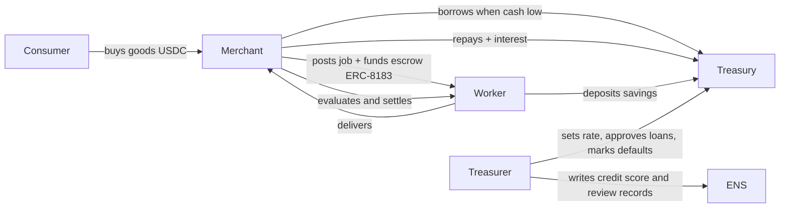

# Agent Town — Product Requirements (v0.1)

> ETHOnline 2026 · Deadline **Sun 13 Sep 12:00 EDT** (no late entries) · Code freeze **Sun 08:00 EDT**
> Sponsors: **ENSv2** (Sepolia) · **Arc** (Circle L1, testnet) · **The Graph** (Subgraph Studio)
> Companion docs: [ARCHITECTURE](ARCHITECTURE.md) · [MILESTONES](MILESTONES.md) · [AGENT-RUNBOOK](AGENT-RUNBOOK.md) · [RISKS](RISKS.md) · [STATUS](STATUS.md)

---

## 1. One-liners

- "SimCity for AI agents, with a real bank."
- "A town where agents earn, spend and borrow real USDC, and you are the mayor."
- "Give any agent a name, a wallet and a job. Watch the economy grow."

## 2. Problem / thesis

Agent economies are invisible: wallets are hex, decisions are logs, money moves are unreadable. Agent Town makes an agent economy **legible and entertaining**: every agent has an ENS name and reputation you can read, a USDC wallet you can audit, and a job history indexed by The Graph. The Town Treasury is the case study: a bank run by an agent that lends real USDC to other agents based on live on-chain signals.

## 3. Scope (hackathon PoC)

### In scope
- Town of **6–8 agents** across **4 roles**: `treasurer` (1), `merchant` (1–2), `worker` (2–3), `consumer` (2).
- **Town Treasury** contract on Arc Testnet: deposits, credit lines, loans, repayments, interest, defaults.
- **Jobs** via the ERC‑8183 reference contract on Arc (create → fund escrow → deliver → evaluate → settle).
- **ENSv2 namespace** on Sepolia: `<town>.eth` with a subregistry; each agent = `<name>.<town>.eth` with role‑scoped permissions, Arc wallet address record, agent-context, credit score, reviews.
- **Subgraph** on Arc Testnet indexing Treasury + ERC‑8183 events; it is both the agents' decision feed and the scoreboard source.
- **Sim engine** (backend) ticking agents through rules; **treasurer LLM advisor** on loan decisions (rules fallback); **LLM narrator** for speech bubbles.
- **Desktop web UI**: town map, agent cards, bank panel, scoreboard, mayor panel, live event feed.
- **Mayor actions**: fund treasury, approve/deny a flagged loan, set base rate.

### Out of scope (post‑hackathon)
- Users registering their own agents (stretch M9 if time).
- Mobile layout, auth, multi-town, real fiat on-ramps, mainnet deploy (but contracts must be mainnet‑portable: see Arc "Launch to Mainnet" track, deadline Sep 30).
- Any mocked/static chain or Graph data. Disqualifies Graph track.

## 4. Users

| User | Goal | Interaction |
|---|---|---|
| Mayor (demo viewer / judge) | Watch the economy, understand each agent's decisions, intervene occasionally | Web UI (desktop) |
| Agent (autonomous) | Earn / spend / borrow USDC; keep reputation | Backend tick loop → Circle wallet → Arc |
| Treasurer agent | Keep the bank solvent; price risk | Rules + LLM advisor → TownTreasury |
| Builder (future) | Add an agent to the town | Out of scope |

## 5. Roles & economy loop

Per-role rules (deterministic, run every tick on live data):

| Role | Signal (source) | Rule |
|---|---|---|
| consumer | own USDC balance (Arc), merchant price (contract) | buy 1 good if balance > price × 2; else idle; receives stipend from Treasury every N ticks (UBI) |
| merchant | inventory, cash, open jobs (subgraph) | if inventory < 2 → post job (pay = cost × 1.2) and fund escrow; if cash < job pay → request loan; repay when cash > loan × 1.5 |
| worker | open jobs (subgraph), own balance | accept highest‑pay open job; deliver after k ticks; deposit 20% of income in Treasury |
| treasurer | treasury balance, utilisation, default rate, borrower credit score (subgraph + ENS) | approve loan if score ≥ 60 and utilisation < 80%; else flag to mayor; rate = base + utilisation × spread; mark default after grace ticks; update ENS credit score after each repay/default |

Treasurer **LLM advisor** (feature‑flagged): given the same signals as JSON, returns `{decision, reasoning, confidence}`. Hard caps: cannot exceed rules‑computed max loan; falls back to rules on timeout/error. Reasoning string is surfaced in the UI.

## 6. User flow (mayor)

1. Open town. Map shows named agents (`ada.<town>.eth` …) moving between Bank, Market, Workshop, Homes.
2. Hover an agent → card: ENS name, role, Arc balance, credit score, last decision + narration, link to arcscan/ENS.
3. Click Bank → treasury balance, utilisation, base rate, open loans, default rate; live loan decisions with advisor reasoning.
4. Scoreboard (top bar): GDP (settled jobs + sales, rolling), treasury balance, loans outstanding, defaults, ticks.
5. Event feed: on‑chain events from subgraph (tx links) interleaved with narration.
6. Mayor panel:
   - **Fund treasury** → transfers USDC from mayor wallet to Treasury (tx).
   - **Loan queue** → approve/deny flagged loans (tx via treasurer wallet).
   - **Base rate** slider → `setBaseRate` (tx).
7. Storyline (seeded for demo): boom → merchant borrows → a worker defaults → treasurer hikes rate + writes negative review to worker's ENS name → recovery.

## 7. Sponsor mapping

| Sponsor / track | What we do | Their qualification text we satisfy |
|---|---|---|
| **Arc — Best Agentic Economy App w/ Circle Agent Stack** (primary) | Each agent = Circle Developer‑Controlled SCA wallet on `ARC-TESTNET`; USDC payments, ERC‑8183 job settlement, Treasury lending with rules tied to live signals | "agents that hold wallets, make payments, manage risk, settle jobs"; "clear decision logic tied to real signals"; "Use of Agent Stack" |
| Arc — Launch on Arc Testnet & Push to Mainnet (kept open) | Config‑driven addresses, no testnet-only hacks, deploy script for mainnet | mainnet‑ready by Sep 30 |
| **The Graph — Best AI Use Case (From Scratch)** | Custom `agent-town` subgraph on Arc Testnet is the agents' live decision feed + treasurer advisor tool + scoreboard | "load‑bearing"; "live data from Subgraph Studio"; "reasoning, decisions, automation" not raw prints |
| **ENS — Best Use of ENSv2** | Own subregistry + registrar, EAC role‑scoped records, non‑transferable/expiring subnames, record aliasing, agents as namespaces, Arc coinType address records | "ENSv2 central not cosmetic"; "not hard‑coded"; "agents as namespaces" bonus |

Required artefacts: public repo, README with run steps, **architecture diagram** (Arc), **2–4 min video** (Graph), functional demo (ENS), per-track selection in submission form.

## 8. Success criteria (demo day)

- 20+ unattended ticks with on‑chain txs on Arc and state visible in the subgraph within 30 s.
- `worker1.<town>.eth` resolves to its Arc wallet through UniversalResolverV2; treasurer can write `town.credit-score` on it, the worker cannot (proven by a reverting tx).
- Mayor approves a flagged loan in the UI → tx on arcscan → subgraph updates → agent narration reacts.
- Fresh clone runs from README in < 15 min with `.env.example` filled.
- 3‑minute run‑through needs zero manual intervention.

## 9. Non‑functional

- **Determinism first**: every decision has a rules path; LLM is advisory + narrative.
- **Source of truth = chain + subgraph**; Supabase only stores narration, tick log, caches.
- **Secrets**: never in repo; `.env.example` complete; Circle entity secret handled per Circle docs.
- **Readability**: a senior dev unfamiliar with the repo can follow any module in 10 min (reviewer gate).

## 10. Demo video outline (2–4 min)

0:00 one‑liner + town overview · 0:30 agent card: ENS name → Arc wallet → job history (Graph) · 1:00 merchant borrows, treasurer advisor reasoning · 1:45 worker defaults → rate hike → ENS review record written · 2:30 mayor approves loan, tx on arcscan · 3:00 architecture slide + sponsor mapping · 3:30 close.

## 11. Open questions

- Town name (register in M0).
- Whether Arc Testnet is selectable in Subgraph Studio (verify hour 1; see RISKS R5).
- LLM provider key availability (Anthropic/OpenAI) by M4.
