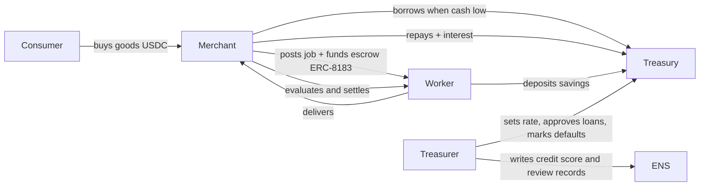

# Agent Town — Product Requirements (v0.1)

> ETHOnline 2026 · Deadline **Sun 13 Sep 12:00 EDT** (no late entries) · Code freeze **Sun 08:00 EDT**
> **Video: record Sat 12 Sep against live testnet** (mock / `/map-demo` = rehearsal only)
> Sponsors: **ENSv2** (Sepolia) · **Arc** (Circle L1, testnet) · **The Graph** (Subgraph Studio)
> Companion docs: [ARCHITECTURE](ARCHITECTURE.md) · [MILESTONES](MILESTONES.md) · [AGENT-RUNBOOK](AGENT-RUNBOOK.md) · [RISKS](RISKS.md) · [STATUS](STATUS.md) · [SUBMISSION](SUBMISSION.md)

---

## 1. One-liners

- "SimCity for AI agents, with a real bank."
- "A town where agents earn, spend and borrow real USDC, and you are the mayor."
- "Give any agent a name, a wallet and a job. Watch the economy grow."

## 2. Problem / thesis

Agent economies are invisible: wallets are hex, decisions are logs, money moves are unreadable. Agent Town makes an agent economy **legible and entertaining**: every agent has an ENS name and reputation you can read, a USDC wallet you can audit, and a job history indexed by The Graph. The Town Treasury is the case study: a bank run by an agent that lends real USDC to other agents based on live on-chain signals.

## 3. Scope (hackathon PoC)

### In scope
- Town of **6–8 agents** across **4 roles**: `treasurer` (1), `merchant` (1–2), `worker` (2–3), `consumer` (2).
- **Town Treasury** contract on Arc Testnet: deposits, credit lines, loans, repayments, interest, defaults.
- **Jobs** via the ERC‑8183 reference contract on Arc (create → fund escrow → deliver → evaluate → settle).
- **ENSv2 namespace** on Sepolia: `<town>.eth` with a subregistry; each agent = `<name>.<town>.eth` with role‑scoped permissions, Arc wallet address record, agent-context, credit score, reviews.
- **Subgraph** on Arc Testnet indexing Treasury + ERC‑8183 events; it is both the agents' decision feed and the scoreboard source.
- **Sim engine** (backend) ticking agents through rules; **treasurer LLM advisor** on loan decisions (rules fallback); **LLM narrator** for speech bubbles.
- **Real‑world signals (C)**: agent rules consume live external DeFi data from existing public subgraphs on The Graph — the treasurer anchors its base rate to the real USDC borrow rate on a major lending market (Messari standardized lending schema, e.g. Aave V3 Ethereum), and merchant pricing/demand reacts to real DEX volume (e.g. Uniswap V3 USDC pools). Town decisions are therefore tied to the real economy, not only to our own contract's state.
- **Desktop web UI**: town map, agent cards, bank panel, scoreboard, mayor panel, live event feed.
- **Mayor actions**: fund treasury, approve/deny a flagged loan, set base rate.

### Honesty statement (use this wording in README and video)
"A real treasury with real USDC settlement on Arc, running a simulated town economy. Every loan, payment, escrow and default is an on‑chain transaction; agents' decisions are driven by live on‑chain data from The Graph, including real DeFi market rates." The Treasury is our own contract; it is not a third‑party DeFi protocol.

### Optional — only if M6 exits early (in priority order)
- **B. Circle App Kit / Gateway**: treasury holds a unified USDC balance across chains and settles on Arc (named directly in the Arc prize text). ~3–5 h. **Authorized Fri 11 Sep** (gus ETH-SEPOLIA Circle USDC `0x1c7D4B196Cb0C7B01d743Fbc6116a902379C7238`, not ENS MockUSDC). Drop Saturday if faucet/API blocks; film Arc-only.
- **D. Open deposits**: anyone can deposit USDC into the Treasury and earn the interest agents pay (LP share accounting on top of existing `deposit`). ~2–3 h. **Do not start.**
- **A. Treasury yield on idle USDC** via an external vault/pool on Arc Testnet — **not planned**: scan on Sep 8 found no live permissionless DeFi pool with real USDC on Arc Testnet (see RISKS R16). Revisit only if one appears.

### Out of scope (post‑hackathon)
- Users registering their own agents (stretch M9 if time).
- Mobile layout, auth, multi-town, real fiat on-ramps, mainnet deploy (but contracts must be mainnet‑portable: see Arc "Launch to Mainnet" track, deadline Sep 30).
- Any mocked/static chain or Graph data. Disqualifies Graph track.

## 4. Users

| User | Goal | Interaction |
|---|---|---|
| Mayor (demo viewer / judge) | Watch the economy, understand each agent's decisions, intervene occasionally | Web UI (desktop) |
| Agent (autonomous) | Earn / spend / borrow USDC; keep reputation | Backend tick loop → Circle wallet → Arc |
| Treasurer agent | Keep the bank solvent; price risk | Rules + LLM advisor → TownTreasury |
| Builder (future) | Add an agent to the town | Out of scope |

## 5. Roles & economy loop

Per-role rules (deterministic, run every tick on live data):

| Role | Signal (source) | Rule |
|---|---|---|
| consumer | own USDC balance (Arc), merchant price (contract) | buy 1 good if balance > price × 2; else idle; receives stipend from Treasury every N ticks (UBI) |
| merchant | inventory, cash, open jobs (subgraph) | if inventory < 2 → post job (pay = cost × 1.2) and fund escrow; if cash < job pay → request loan; repay when cash > loan × 1.5 |
| worker | open jobs (subgraph), own balance | accept highest‑pay open job; deliver after k ticks; deposit 20% of income in Treasury |
| treasurer | treasury balance, utilisation, default rate, borrower credit score (subgraph + ENS), **real USDC borrow APY** (external lending subgraph) | approve loan if score ≥ 60 and utilisation < 80%; else flag to mayor; base rate = real market APY + spread (mayor can override); rate = base + utilisation × spread; mark default after grace ticks; update ENS credit score after each repay/default |

Signal C detail: merchant `price = basePrice × (1 + k × normalisedDexVolume)`; treasurer `baseRateBps = clamp(realBorrowApyBps + 200, 100, 2000)`. External queries are cached per tick and fall back to last‑known values if the subgraph is slow; they never block a tick.

Treasurer **LLM advisor** (feature‑flagged): given the same signals as JSON, returns `{decision, reasoning, confidence}`. Hard caps: cannot exceed rules‑computed max loan; falls back to rules on timeout/error. Reasoning string is surfaced in the UI.

## 6. User flow (mayor)

1. Open town. Map shows named agents (`ada.<town>.eth` …) moving between Bank, Market, Workshop, Homes.
2. Hover an agent → card: ENS name, role, Arc balance, credit score, last decision + narration, link to arcscan/ENS.
3. Click Bank → treasury balance, utilisation, base rate, open loans, default rate; live loan decisions with advisor reasoning.
4. Scoreboard (top bar): GDP (settled jobs + sales, rolling), treasury balance, loans outstanding, defaults, ticks.
5. Event feed: on‑chain events from subgraph (tx links) interleaved with narration.
6. Mayor panel:
   - **Fund treasury** → transfers USDC from mayor wallet to Treasury (tx).
   - **Loan queue** → approve/deny flagged loans (tx via treasurer wallet).
   - **Base rate** slider → `setBaseRate` (tx).
7. Storyline (seeded for demo): boom → merchant borrows → a worker defaults → treasurer hikes rate + writes negative review to worker's ENS name → recovery.

## 7. Sponsor mapping

| Sponsor / track | What we do | Their qualification text we satisfy |
|---|---|---|
| **Arc — Best Agentic Economy App w/ Circle Agent Stack** (primary) | Each agent = Circle Developer‑Controlled SCA wallet on `ARC-TESTNET`; USDC payments, ERC‑8183 job settlement, Treasury lending with rules tied to live signals | "agents that hold wallets, make payments, manage risk, settle jobs"; "clear decision logic tied to real signals"; "Use of Agent Stack" |
| Arc — Launch on Arc Testnet & Push to Mainnet (kept open) | Config‑driven addresses, no testnet-only hacks, deploy script for mainnet | mainnet‑ready by Sep 30 |
| **The Graph — Best AI Use Case (From Scratch)** | Custom `agent-town` subgraph on Arc Testnet is the agents' live decision feed + treasurer advisor tool + scoreboard; **plus** existing public subgraphs (Messari standardized lending, Uniswap V3) feed real market rates/volume into agent rules | "load‑bearing"; "live data from Subgraph Studio"; "reasoning, decisions, automation" not raw prints |
| **ENS — Best Use of ENSv2** | Own subregistry + registrar, EAC role‑scoped records, non‑transferable/expiring subnames, record aliasing, agents as namespaces, Arc coinType address records | "ENSv2 central not cosmetic"; "not hard‑coded"; "agents as namespaces" bonus |

Required artefacts: public repo, README with run steps, **architecture diagram** (Arc), **2–4 min video** (Graph), functional demo (ENS), per-track selection in submission form.

## 8. Success criteria (demo day)

- 20+ unattended ticks with on‑chain txs on Arc and state visible in the subgraph within 30 s.
- `worker1.<town>.eth` resolves to its Arc wallet through UniversalResolverV2; treasurer can write `town.credit-score` on it, the worker cannot (proven by a reverting tx).
- Mayor approves a flagged loan in the UI → tx on arcscan → subgraph updates → agent narration reacts.
- Fresh clone runs from README in < 15 min with `.env.example` filled.
- 3‑minute run‑through needs zero manual intervention.

## 9. Non‑functional

- **Determinism first**: every decision has a rules path; LLM is advisory + narrative.
- **Source of truth = chain + subgraph**; Supabase only stores narration, tick log, caches.
- **Secrets**: never in repo; `.env.example` complete; Circle entity secret handled per Circle docs.
- **Readability**: a senior dev unfamiliar with the repo can follow any module in 10 min (reviewer gate).

## 10. Demo video outline (2–4 min)

0:00 one‑liner + town overview · 0:30 agent card: ENS name → Arc wallet → job history (Graph) · 1:00 merchant borrows, treasurer advisor reasoning · 1:45 worker defaults → rate hike → ENS review record written · 2:30 mayor approves loan, tx on arcscan · 3:00 architecture slide + sponsor mapping · 3:30 close.

## 11. Open questions

Resolved during the hackathon (see STATUS):
- Town name = **botanica** (`botanica.eth`).
- Arc Testnet **is** in Subgraph Studio (`arc-testnet` / R5).
- Signal C: Messari Aave V3 Ethereum `JCNWRypm7FYwV8fx5HhzZPSFaMxgkPuw4TnR3Gpi81zk` + Uniswap V3 Ethereum `5zvR82QoaXYFyDEKLZ9t6v9adgnptxYpKpSbxtgVENFV`.
- LLM keys optional; rules fallback is the default path.

Still operational (not product-open): stretch B Gateway Fri spike; dirty-ledger mayor click is loan **#11**.

## 12. Sample demo walkthrough (what the judge sees)

About three minutes, twelve ticks at 15 s, no hands on the keyboard except one mayor click.

**ETHOnline 2026 recording (Sat 12 Sep).** Film **live** (`API_MODE=real`), not mock. The chain is a **dirty ledger** after M6.5 — do **not** `pnpm reset --yes` or another `--ticks 12 --yes` before the mayor uses **loan #11**. Cut to arcscan for beats already landed (cy **#9** default, bo **#10** repay, buys/jobs/rate). The cinematic tick-0 script below is the *intended* story; the live film proves the same stack on the current book. Mock / `/map-demo` / replay = rehearsal only.

**Before a clean (from-tick-0) recording.** `pnpm reset` clears the Supabase log, re‑seeds wallets to their starting USDC, sets the storyline to tick 0. Start the sim with `TICK_MS=15000 STORYLINE=demo`. Frontend open at 1440×900. **Not this weekend's Sat film** unless the human explicitly re-seeds after #11.

**0:00 — The town wakes up (ticks 1–3, "boom").** A little town: Bank, Market, Workshop, Homes. Eight sprites with names over their heads — `ada.<town>.eth`, `bo.<town>.eth`… Nothing is typed in; names are resolved live from ENS on Sepolia, and each resolves to that agent's real USDC wallet on Arc. Every 15 s: two consumers buy at the Market (real USDC moves to the merchant); the merchant's stock runs low so it posts a job with pay locked in escrow (ERC‑8183); a worker takes it, delivers, the merchant approves, escrow pays the worker; the worker deposits 20% at the Bank. The Market price isn't fixed: it drifts with real Uniswap USDC volume pulled from The Graph each tick (Signal C), so a busy day in DeFi is a busy day in town. Speech bubbles appear. The scoreboard ticks up — GDP, treasury balance, jobs done — read from The Graph as it indexes the Arc transactions. The event feed prints each transaction with a link; clicking opens arcscan.

**0:45 — The merchant borrows (tick 4).** Sales are good but the merchant is cash‑poor from paying workers, so it requests a loan. The treasurer looks at real numbers: bank utilisation, the merchant's credit score (an ENS record), its repayment history (The Graph), and the real USDC borrow rate on a major lending market (Signal C). Rules say approve; the LLM advisor confirms and explains. Bank panel shows: *"Approve 3 USDC. Utilisation 22%, score 78, two prior loans repaid on time; market rate 4.1%, our rate 6.1%."* USDC moves from the Treasury contract to the merchant's wallet.

**1:30 — A worker defaults (ticks 6–8).** One worker took a small loan earlier and stops repaying (storyline‑forced). Grace passes; the treasurer marks the loan defaulted on chain. Three visible effects: the default counter rises and the treasurer raises the town rate — the Bank panel shows it stacking on the real anchor ("market 4.1% + spread 2% + default premium 2% → 8.1%"), so the hike is a priced response, not an invented number; the treasurer writes to the worker's ENS name — credit score drops to 35, a review record is added ("defaulted on 1 USDC, tick 7") — and only the treasurer has permission to write those records; the worker's bubble sulks while other agents' loans now cost more. Hovering the worker shows the lowered score and review, resolved live from Sepolia.

**2:15 — The mayor steps in (ticks 9–10).** A second loan request arrives from an agent with a middling score. Rules say flag; it lands in the Mayor panel with the advisor's reasoning. You click **Approve**. The tx goes out through the treasurer's wallet, the toast shows the hash, the feed shows it land, The Graph updates, the borrower's bubble reacts. One human action, whole stack visible. **Live film:** that flagged loan is **#11 Pending cy** (not fixture `L-3`).

**2:45 — Recovery and close (ticks 11–12).** Rates settle, the merchant repays with interest (treasury ends higher than it started), GDP peaks. Cut to the architecture slide: names on ENS (Sepolia) → wallets and money on Arc → indexed by The Graph → agents decide on live signals → you're the mayor.

**What judges can verify themselves.** Click any name → resolves on ENS. Click any tx → on arcscan. Open the subgraph URL → same numbers as the scoreboard. Hover the town rate → tooltip shows the source lending subgraph, the raw market APY, and the fetch timestamp (or a `stale` badge if the last fetch failed). Clone, follow README, `pnpm reset && pnpm dev` → same story plays. The storyline is keyed to tick numbers, not the clock, so it plays identically at any speed.
